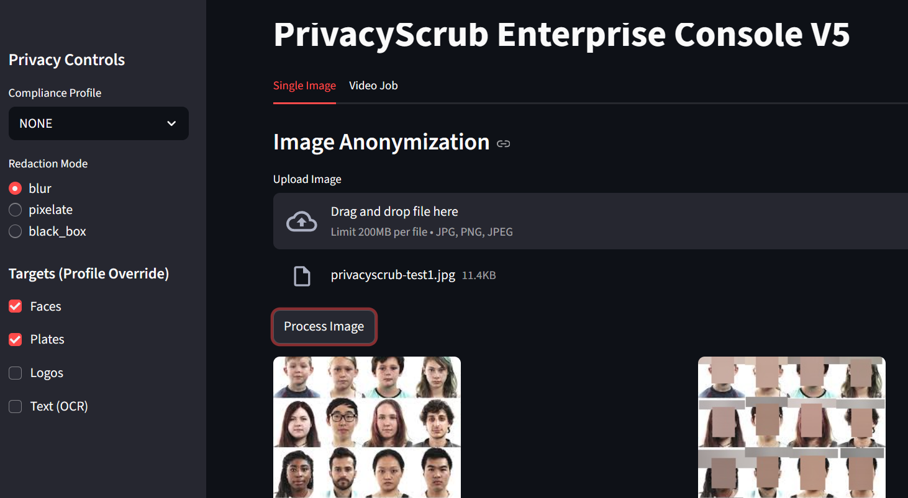

# PrivacyScrub V5 – GPU-Accelerated Video Anonymization Service

PrivacyScrub V5 is a **cloud-native video anonymization pipeline** that detects, tracks, and anonymizes **faces, license plates, and other sensitive entities** in user-uploaded videos.

It is implemented as a set of microservices on Google Cloud (Cloud Run + Terraform), with a Streamlit front end for uploads and downloads and a FastAPI-based control plane for orchestration and status tracking.

---

## 1. Project Overview

### 1.1 Problem

Teams want to use video (dashcams, workplace cameras, screen recordings) for **analytics, training, and collaboration**, but raw footage often contains:

- Faces  
- License plates  
- Screen regions or environments that should not be shared  

Manual redaction is:

- Slow and inconsistent  
- Hard to scale as the volume of video grows  
- Error-prone from a **privacy and compliance** perspective  

### 1.2 Solution

PrivacyScrub V5 provides an **end-to-end anonymization service**:

1. A non-technical user uploads a video.  
2. The system splits, processes, and reassembles it using GPU-accelerated detection and tracking.  
3. The user downloads a **share-safe, redacted video** where sensitive entities are consistently anonymized over time.

Key properties:

- Designed for **multi-minute videos** via chunking and stitching.  
- GPU-first design for heavy detection workloads.  
- Explicit job lifecycle and idempotent processing.  
- Backed by design documents (DM), requirements (SRS), and tests (TDD) for V1–V5.  

---

## 2. High-Level Architecture

The system consists of:

- **Streamlit UI** (`frontend/`): upload video, submit jobs, poll status, and download results.  
- **Gateway service** (`services/gateway/`): FastAPI service for job creation, state management, and task dispatch.  
- **Orchestrator service** (`services/orchestrator/`): splits videos into chunks, dispatches chunk-processing tasks, and handles final stitching.  
- **GPU worker service** (`services/gpu-worker/`): runs YOLOv8-based detection, tracking, and anonymization on each chunk.  
- **GCS**: stores raw video, chunked segments, and final redacted assets.  
- **Firestore / job state**: tracks job lifecycle and progress.  
- **Terraform** (`terraform/`): defines Cloud Run services, IAM, and core infrastructure.  

### 2.1 Architecture Diagram

Rendered diagram (exported for the portfolio):



---

## 3. Core Features

### 3.1 Detection and Anonymization

- **Detectors**
  - YOLOv8 models for:
    - Faces
    - License plates
    - Optional full-body/person regions
- **Tracking / Re-ID**
  - DeepSORT-style tracking to maintain identity across frames.
  - Re-identification embeddings to keep a single identity anonymized consistently even if they leave and re-enter the frame.
- **Anonymization Modes**
  - Configurable per class:
    - Gaussian blur
    - Pixelation
    - Solid mask
  - Temporal smoothing to reduce bounding-box jitter and flicker.

### 3.2 Chunked Processing and Stitching

- Uses **FFmpeg** to split large uploads into fixed-duration chunks.  
- Each chunk is processed independently by the GPU worker.  
- Final stage:
  - Concatenate redacted chunks.  
  - Normalize container/codec as needed.  
  - Strip metadata (e.g., Exif) to avoid leaking sensitive information.  

### 3.3 Job Lifecycle & State

Job states are stored in Firestore and move through:

- `QUEUED` → `CHUNKING` → `PROCESSING` → `STITCHING` → `COMPLETED` or `FAILED`  

Each job record includes:

- Input and output paths  
- Number of chunks and chunks completed  
- Error details (if any)  
- Timestamps and basic telemetry  

The processing is designed to be **idempotent**: replaying a task or re-running a chunk does not corrupt the final result.

---

## 4. Repository Structure

High-level layout (see `Get-ChildItem -Recurse` for full detail):

```text
privacyscrub-v5/
├─ docs/
│  ├─ Burns_Greg_CS_1P_PrivacyScrub_V5.pdf
│  ├─ Burns_Greg_CS_PrivacyScrub_V5.html
│  ├─ Burns_Greg_PrivacyScrub_V1.html
│  ├─ Burns_Greg_PrivacyScrub_V2.html
│  ├─ Burns_Greg_PrivacyScrub_V3.html
│  ├─ Burns_Greg_PrivacyScrub_V4.html
│  ├─ DM - Personal - PrivacyScrub V5.pdf
│  ├─ SRS - Personal - PrivacyScrub V4.pdf
│  └─ SRS+TDD - Personal - PrivacyScrub V5.pdf
├─ frontend/
│  └─ streamlit_app.py
├─ images/
│  ├─ Burns_Greg_CS_PrivacyScrub_V5.svg
│  └─ Burns_Greg_CS_PrivacyScrub_V5_screen.png
├─ model_cache/
│  ├─ easyocr_models/
│  ├─ license_plate_detector.pt
│  ├─ yolov8m.pt
│  └─ yolov8n-face.pt
├─ notebooks/
│  ├─ Burns_Greg_PrivacyScrub_V1.ipynb
│  ├─ Burns_Greg_PrivacyScrub_V2.ipynb
│  ├─ Burns_Greg_PrivacyScrub_V3.ipynb
│  └─ Burns_Greg_PrivacyScrub_V4.ipynb
├─ scripts/
│  ├─ deploy_v5.ps1
│  ├─ download_models.py
│  ├─ quick-deploy.ps1
│  └─ quick-deploy2.ps1
├─ services/
│  ├─ gateway/
│  ├─ gpu-worker/
│  └─ orchestrator/
└─ terraform/
   ├─ main.tf
   ├─ outputs.tf
   ├─ providers.tf
   └─ variables.tf
```

Key directories:

- `frontend/` – Streamlit UI for uploads and downloads.  
- `services/gateway/` – FastAPI service for job creation, status, and orchestration.  
- `services/orchestrator/` – Splits, dispatches, and stitches video chunks.  
- `services/gpu-worker/` – GPU-accelerated detection, tracking, and anonymization.  
- `docs/` – Design docs (DM, SRS, TDD) and portfolio case studies.  
- `images/` – Architecture diagram and portfolio screenshots.  
- `terraform/` – IaC for Cloud Run services, IAM, and core resources.  

---

## 5. Frontend (Streamlit UI)

The Streamlit app in `frontend/streamlit_app.py` provides:

- **Video upload** widget for selecting a local file.  
- Job submission that POSTs to the FastAPI gateway.  
- **Status polling** (via job ID) to show current state (QUEUED, PROCESSING, etc.).  
- A **download link** for the final redacted video when the job is marked COMPLETED.  

Screenshot:



---

## 6. Services

### 6.1 Gateway Service (`services/gateway/`)

Responsibilities:

- Accept `POST /jobs` with video uploads.  
- Store raw input in GCS.  
- Create and update job documents in Firestore.  
- Dispatch initial tasks to kick off ingestion/chunking.  
- Expose `GET /jobs/{job_id}` for status polling by the UI.  

### 6.2 Orchestrator Service (`services/orchestrator/`)

Responsibilities:

- Respond to ingestion tasks to:
  - Download raw video from GCS.  
  - Run FFmpeg to split into chunks.  
  - Upload chunks back to GCS.  
  - Create per-chunk state entries if needed.  
- Dispatch processing tasks for each chunk.  
- Monitor chunk completion and trigger final stitching once all chunks are done.  

### 6.3 GPU Worker Service (`services/gpu-worker/`)

Responsibilities:

- On each chunk-processing task:
  - Download the chunk from GCS.  
  - Run detectors (faces, plates, optional full-body).  
  - Track identities across frames (DeepSORT + Re-ID).  
  - Apply anonymization masks (blur/pixelation/solid).  
  - Upload redacted chunk back to GCS.  
  - Update job/chunk progress in Firestore.  

The GPU worker also makes use of `model_cache/` to avoid downloading model weights on every container start.

---

## 7. Deployment (Terraform + Scripts)

The `terraform/` directory defines:

- Cloud Run services for:
  - Gateway  
  - Orchestrator  
  - GPU worker  
- IAM roles and service accounts.  
- GCS buckets for raw/chunked/final assets.  
- Any additional infra used by the job state and queueing layer.  

Deployment helpers:

- `scripts/deploy_v5.ps1` – orchestrates container builds and Terraform apply for V5.  
- `scripts/download_models.py` – utility to populate `model_cache/` with required model weights.  

> **Note:** You’ll need a GCP project, appropriate permissions, and billing enabled to deploy this end-to-end.

---

## 8. Documentation Set

This project is documented like a small internal product:

- **Design Memo (DM):**  
  `docs/DM - Personal - PrivacyScrub V5.pdf` – System goals, constraints, and architecture evolution.

- **Requirements & Tests (SRS + TDD):**  
  `docs/SRS+TDD - Personal - PrivacyScrub V5.pdf` – Functional and non-functional requirements, test design, and coverage.

- **Version History (V1–V4):**  
  `docs/Burns_Greg_PrivacyScrub_V1.html` through `V4.html` and corresponding notebooks (`notebooks/`) show how the system evolved from a single script to a robust service.

- **Portfolio Case Study:**  
  `docs/Burns_Greg_CS_PrivacyScrub_V5.html` – Long-form narrative for the portfolio site.

- **Recruiter One-Pager:**  
  `docs/Burns_Greg_CS_1P_PrivacyScrub_V5.pdf` – Condensed, recruiter-facing summary.

---

## 9. How to Use This Repo (For Reviewers)

If you are a reviewer, hiring manager, or engineer evaluating this project, the fastest way to understand it is:

1. **Read the one-page summary:**  
   `docs/Burns_Greg_CS_1P_PrivacyScrub_V5.pdf`
2. **Scan the case study:**  
   `docs/Burns_Greg_CS_PrivacyScrub_V5.html`
3. **Review the architecture diagram and Mermaid source:**  
   - `images/Burns_Greg_CS_PrivacyScrub_V5.svg`  
   - Mermaid block in this `README.md`
4. **Inspect the core services:**  
   - `services/gateway/main.py`  
   - `services/orchestrator/main.py`  
   - `services/gpu-worker/main.py`
5. **Optionally, review the design docs (DM, SRS, TDD)** if you want to see how I handle requirements, testing, and versioned evolution.

---

## 10. Author

**Greg Burns**  
Machine Learning Engineer · Systems Architect  
- Portfolio: https://burnsgregm.netlify.app/portfolio.html  
- GitHub: https://github.com/burnsgregm  
- Email: burnsgregm@gmail.com  
